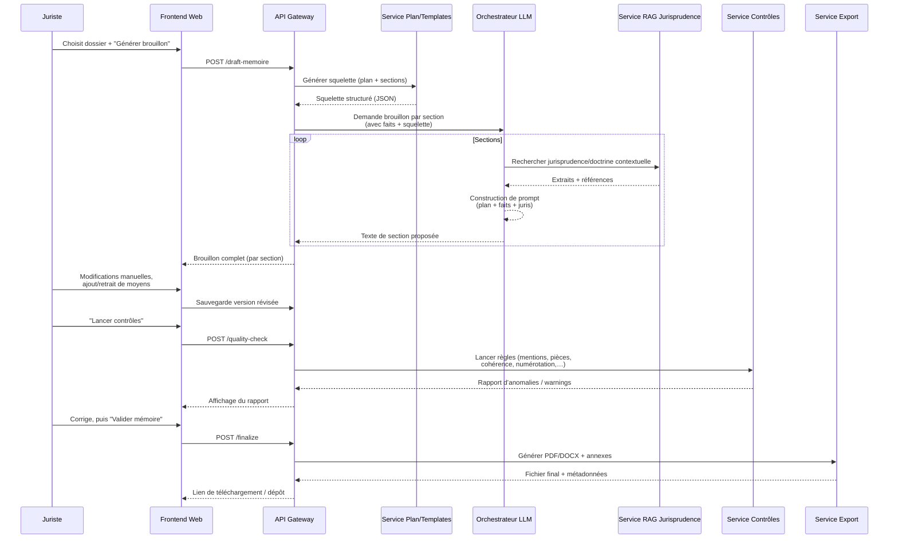

OK, allons-y pour un vrai “système complet” 😄

Je te propose :

1. Un **workflow fonctionnel** (ce qui se passe du point de vue métier).
2. Une **architecture applicative/microservices** (ce qui tourne en K8S ou autre).
3. Un **zoom sur le flux de génération d’un mémoire**.

---

## 1. Workflow fonctionnel complet

```mermaid
flowchart TB
    subgraph Acteurs
        J[Juriste / Avocat]
        C[Client interne / Administration]
    end

    C -->|Transmet dossier, pièces, objectifs| UI[Portail web<br/>Mémoire en défense]

    UI -->|Formulaire structuré<br/>(identité, faits, demandes)| S1[Intake Dossier<br/>& Normalisation]
    UI -->|Upload pièces (PDF, DOCX)| S2[Gestion documentaire<br/>& OCR]

    S1 --> S3[Pré-analyse automatique\n(NLP + extraction de faits)]
    S2 --> S3

    S3 --> S4[Classification du litige<br/>(type, juridiction, matière)]
    S4 --> S5[Suggestion de plan<br/>& squelette de mémoire]

    S5 --> J_UI[Interface juriste<br/>(éditeur structuré)]
    J -->|Valide / ajuste plan| J_UI

    J_UI -->|Demande 1er brouillon| S6[Génération de brouillon<br/>(LLM + modèles types)]
    S6 --> S7[Recherche jurisprudence<br/>& doctrine (RAG)]
    S7 --> S6

    S6 --> J_UI2[Interface juriste<br/>Brouillon annotable]
    J -->|Révisions, ajouts de moyens,<br/>réécriture humaine| J_UI2

    J_UI2 --> S8[Contrôles automatiques<br/>(cohérence, mentions obligatoires,<br/>références de pièces)]
    S8 -->|Rapport de contrôle| J_UI2

    J_UI2 -->|Soumettre pour finalisation| S9[Validation finale\n& génération PDF/Word]
    S9 --> ARCH[Archivage dossier<br/>& indexation interne]
    S9 --> C_OUT[Transmission au greffe / adversaire]

    ARCH --> ANALYTICS[Statistiques, réutilisation<br/>modèles, retour d’expérience]
```

---

## 2. Architecture applicative / microservices (vue SI)

Chaque bloc = idéalement un microservice conteneurisé.

```mermaid
flowchart LR
    subgraph Client
        FE[Frontend Web<br/>(React/Vue + éditeur riche)]
    end

    subgraph Edge
        APIGW[API Gateway<br/>+ Auth (OIDC/SAML)]
        WAF[WAF / Reverse Proxy]
    end

    FE --> WAF --> APIGW

    subgraph Backend["Backend applicatif (Kubernetes, etc.)"]
        DIR[Intake Service<br/>(dossier & formulaires)]
        DMS[Document Management<br/>+ OCR/Extraction]
        NLP[Service NLP<br/>(extraction de faits,<br/>classification, NER)]
        PLAN[Service Plan & Templates<br/>(règles + modèles types)]
        LLM_ORCH[Orchestrateur LLM<br/>(prompting, garde-fous,<br/>appels modèles)]
        RAG[Service Jurisprudence RAG<br/>(recherche & ranking)]
        QA[Service Qualité<br/> & Contrôles automatiques]
        EXPORT[Service Export<br/>(PDF/DOCX, signatures)]
        AUDIT[Journalisation & Traçabilité]
    end

    APIGW --> DIR
    APIGW --> DMS
    APIGW --> NLP
    APIGW --> PLAN
    APIGW --> LLM_ORCH
    APIGW --> QA
    APIGW --> EXPORT

    DIR --> DMS
    DIR --> NLP
    NLP --> PLAN
    PLAN --> LLM_ORCH
    DMS --> NLP

    LLM_ORCH --> RAG
    RAG --> LLM_ORCH

    LLM_ORCH --> QA
    QA --> EXPORT

    EXPORT --> AUDIT
    DIR --> AUDIT
    DMS --> AUDIT
    LLM_ORCH --> AUDIT

    subgraph Data["Stockage & données"]
        DB_CASES[(Base dossiers<br/>& métadonnées)]
        DB_DOCS[(Stockage pièces<br/>(Obj. Storage, index plein texte))]
        DB_JURIS[(Base jurisprudence<br/>+ index vecteur)]
        DB_CONFIG[(Modèles, templates,<br/>règles métier)]
        LOGS[(Logs, traces,<br/>metrics sécurité)]
    end

    DIR <---> DB_CASES
    DMS <---> DB_DOCS
    RAG <---> DB_JURIS
    PLAN <---> DB_CONFIG
    AUDIT --> LOGS
```

---

## 3. Zoom sur le flux de génération d’un mémoire (LLM + humain)



---

## 4. Mapping rapide “étape métier → brique technique”

| Étape métier                           | Service principal          | Commentaire rapide                         |
| -------------------------------------- | -------------------------- | ------------------------------------------ |
| Saisie du dossier / formulaire         | `Intake` + Frontend        | Contrôles de base, authentification        |
| Upload & traitement des pièces         | `Document Management`      | OCR, extraction texte, index               |
| Pré-analyse & classification du litige | `NLP Service`              | NER, classification, résumé                |
| Génération du plan / squelette         | `Plan & Templates`         | Règles métier + templates versionnés       |
| Brouillon de mémoire                   | `LLM Orchestrator` + `RAG` | Prompting contrôlé + récupération juris    |
| Relecture & édition par juriste        | Frontend éditeur structuré | Track changes, commentaires                |
| Contrôles automatiques                 | `QA Service`               | Règles procédurales, cohérence interne     |
| Export & signature                     | `Export Service`           | PDF/DOCX, pagination, sommaire, filigranes |
| Archivage & stats                      | `DB_CASES` + `Analytics`   | Réutilisation, amélioration des templates  |

---

Si tu veux, à la prochaine étape on peut :

* soit **détailler chaque microservice** (API, payloads JSON typiques),
* soit **penser directement en infra K8S** (namespaces, ingress, secrets, stockage, observabilité) pour en faire un blueprint d’implémentation.

---

Parfait, on descend d’un cran vers du concret 💼🛠️

Je te propose un **MVP très réaliste**, que tu pourrais faire coder en quelques jours.

---

## 1. Objectif du MVP

> **Générer un premier brouillon structuré de mémoire en défense à partir :**
> – d’un formulaire structuré (faits + demandes du requérant)
> – de quelques paramètres (juridiction, type de litige, ton souhaité)
> 👉 puis laisser le juriste réécrire / corriger.

**Important :**
➡️ **Pas** de jurisprudence automatique dans le MVP (pour éviter les hallucinations et la complexité).
➡️ LLM **interdit** d’inventer des références : il rédige “en général”, sans citer d’articles ni de décisions, ou bien avec des placeholders.

---

## 2. Fonctionnalités incluses / exclues

### Inclus dans le MVP

* Auth simple (ou même pas, si usage interne dev).
* Création d’un “dossier” avec :

  * Identification (nom du requérant, défendeur, référence interne).
  * Type de contentieux (à limiter → ex : contentieux administratif / recours).
  * Juridiction (ex : TA / CAA).
  * Résumé des **faits** (zone de texte).
  * Résumé des **moyens du requérant**.
  * Objectif de la défense (rejet total, rejet partiel, transaction…).
  * Ton souhaité : neutre / technique / pédagogique / offensif.
* Génération automatique d’un **plan standard** de mémoire en défense.
* Génération du **brouillon complet** par le LLM, avec les sections :

  * Rappel de la procédure
  * Rappel des faits
  * Discussion en droit (réponse aux moyens)
  * Conclusions (dispositif, rejets, etc.)
* Interface pour :

  * Afficher le brouillon
  * Le modifier à la main (éditeur texte riche ou markdown)
  * Sauvegarder les versions.
* Export **en .docx** ou **.pdf** basique (template simple).

### Exclu du MVP (pour plus tard)

* Upload / analyse automatique des pièces.
* Recherche jurisprudentielle automatique.
* Gestion fine des droits / multi-organisations.
* Historique avancé, diff, commentaires multi-utilisateurs.
* Règles procédurales complexes (délais, exceptions de procédure, etc.).

---

## 3. UX globale (côté juriste)

```mermaid
flowchart TB
    A[1. Créer un dossier] --> B[2. Remplir formulaire structuré<br>(faits, moyens, objectifs)]
    B --> C[3. Générer plan standard<br>(bouton "Proposer un plan")]
    C --> D[4. Afficher/ajuster plan<br>(checkbox pour sections)]
    D --> E[5. Générer brouillon<br>(bouton "Générer le mémoire")]
    E --> F[6. Relecture & édition<br>(éditeur texte)]
    F --> G[7. Export .docx / .pdf]
```

---

## 4. Architecture MVP (simple et déployable)

On reste **sobre** :

* 1 frontend (SPA légère)
* 1 backend (API REST)
* 1 base de données
* 1 connecteur LLM (OpenAI-like ou local type vLLM / Ollama)

```mermaid
flowchart LR
    FE[Frontend Web\n(React/Next/Vue)] --> API[Backend API\n(FastAPI / Node)]
    API --> DB[(PostgreSQL)]
    API --> LLM[Service LLM\n(OpenAI / Ollama / vLLM)]
```

### Backend – endpoints principaux

* `POST /cases` : créer un dossier
* `GET /cases/{id}` : récupérer un dossier
* `POST /cases/{id}/plan` : générer un plan standard
* `POST /cases/{id}/draft` : générer un brouillon à partir :

  * du plan
  * des faits
  * des moyens
  * des paramètres (juridiction, ton)
* `PUT /cases/{id}/draft` : enregistrer la version éditée
* `GET /cases/{id}/draft` : récupérer le brouillon
* `POST /cases/{id}/export` : générer un .docx/.pdf

---

## 5. Modèle de données minimal

En pseudo-JSON / SQL :

```json
Case {
  id: string,
  reference_interne: string,
  requérant: string,
  défendeur: string,
  juridiction: "TA" | "CAA" | "CE",
  type_contentieux: "excès de pouvoir" | "plein contentieux" | "autre",
  resume_faits: string,
  resume_moyens_requérant: string,
  objectif_defense: "rejet_total" | "rejet_partiel" | "transaction",
  ton_souhaite: "neutre" | "technique" | "pédagogique" | "offensif",
  plan: PlanMemoire | null,
  draft_ai: string | null,
  draft_final: string | null,
  created_at: datetime,
  updated_at: datetime
}
```

Le `PlanMemoire` peut être une simple liste ordonnée de sections :

```json
PlanMemoire {
  sections: [
    {key: "procedure", titre: "I. Rappel de la procédure", actif: true},
    {key: "faits", titre: "II. Rappel des faits", actif: true},
    {key: "discussion", titre: "III. Discussion", actif: true},
    {key: "dispositif", titre: "IV. Conclusions", actif: true}
  ]
}
```

---

## 6. Orchestration LLM (MVP)

On fait **simple** :
→ **un seul appel LLM** qui génère tout le mémoire d’un coup.

### Prompt système (exemple)

```text
Tu es un juriste spécialisé en contentieux administratif.
Tu aides à rédiger des mémoires en défense.

Contraintes :
- Tu NE DOIS PAS inventer de jurisprudence ni de références d'articles.
- Tu peux parler de notions juridiques de manière générale.
- Respecte strictement le plan fourni.
- Style : clair, structuré, professionnel.
- Langue : français juridique.

Si une information manque, indique clairement qu'elle est à compléter par le juriste
(ex : "[À compléter : ...]") plutôt que d'inventer.
```

### Prompt utilisateur (exemple)

```json
{
  "juridiction": "TA",
  "type_contentieux": "recours pour excès de pouvoir",
  "ton_souhaite": "neutre",
  "plan": [
    "I. Rappel de la procédure",
    "II. Rappel des faits",
    "III. Discussion",
    "IV. Conclusions"
  ],
  "faits": "Le requérant conteste l'arrêté du maire du 12 janvier 2024 ...",
  "moyens_requérant": "1°) Incompétence de l'auteur de l'acte ; 2°) Vice de procédure ; 3°) Erreur manifeste d'appréciation.",
  "objectif_defense": "rejet_total"
}
```

Le backend transforme ça en **prompt texte** structuré, en insérant les sections.

---

## 7. Format de sortie LLM

Pour faciliter l’édition côté frontend, tu peux demander un **format markdown** :

```text
# Mémoire en défense

## I. Rappel de la procédure
[Texte...]

## II. Rappel des faits
[Texte...]

## III. Discussion
### 1. Sur l'incompétence alléguée
[Texte...]

### 2. Sur le vice de procédure
[Texte...]

### 3. Sur l'erreur manifeste d'appréciation
[Texte...]

## IV. Conclusions
[Texte...]
```

Dans le MVP, tu gardes juste une **zone d’édition markdown** avec prévisualisation, ce qui simplifie beaucoup l’UI et l’export.

---

## 8. Export simple .docx / .pdf

MVP réaliste :

* Backend :

  * Convertir markdown → HTML → DOCX (lib python `python-docx` par ex.).
  * Puis, éventuellement, DOCX → PDF via LibreOffice en CLI *ou* un service externe.
* Template minimal :

  * En-tête avec :

    * juridiction
    * parties
    * référence dossier

Pas besoin d’un truc parfait visuellement, juste **propre et imprimable**.

---

## 9. Roadmap mini (MVP → v2)

| Version         | Fonctionnalités clés                                                                                                            |
| --------------- | ------------------------------------------------------------------------------------------------------------------------------- |
| v0              | Formulaire + LLM génère un mémoire brut (une page, pas forcément très structuré)                                                |
| v1 (MVP décrit) | Plan structuré, sections, édition markdown, export docx/pdf                                                                     |
| v2              | Ajout upload de pièces + champs “résumé de pièce” + premiers contrôles automatiques (présence des mentions, longueur max, etc.) |
| v3              | RAG jurisprudentiel, citations contrôlées, gestion multi-utilisateurs/droits                                                    |

---

Si tu veux, je peux te proposer **dans un message suivant** :

* soit un **exemple d’API FastAPI complet** (modèles Pydantic + routes) pour ce MVP,
* soit un **schema YAML OpenAPI** minimal que tu pourrais brancher directement dans un générateur de client / front.

