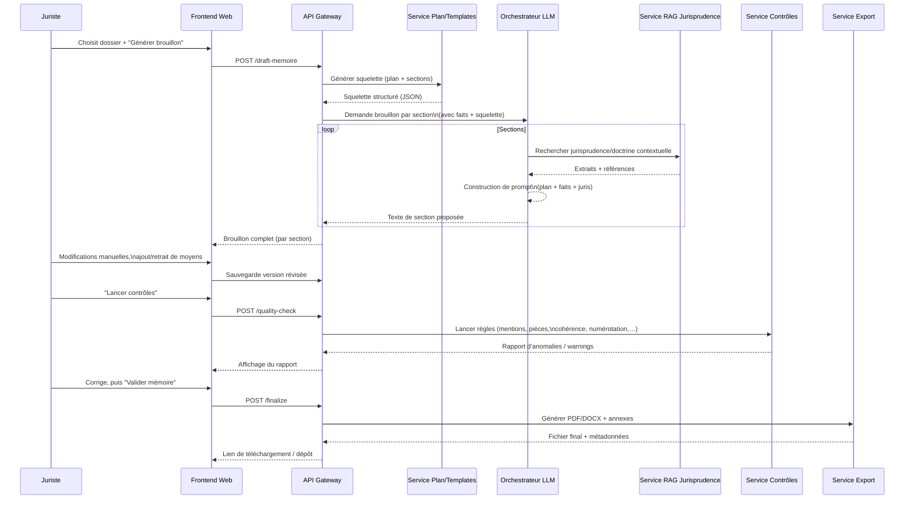

OK, allons-y pour un vrai “système complet” 😄

Je te propose :

1. Un **workflow fonctionnel** (ce qui se passe du point de vue métier).
2. Une **architecture applicative/microservices** (ce qui tourne en K8S ou autre).
3. Un **zoom sur le flux de génération d’un mémoire**.

---

## 1. Workflow fonctionnel complet

```mermaid
flowchart TB
    subgraph Acteurs
        J[Juriste / Avocat]
        C[Client interne / Administration]
    end

    C -->|Transmet dossier, pièces, objectifs| UI[Portail web\nMémoire en défense]

    UI -->|Formulaire structuré\n(identité, faits, demandes)| S1[Intake Dossier\n& Normalisation]
    UI -->|Upload pièces (PDF, DOCX)| S2[Gestion documentaire\n& OCR]

    S1 --> S3[Pré-analyse automatique\n(NLP + extraction de faits)]
    S2 --> S3

    S3 --> S4[Classification du litige\n(type, juridiction, matière)]
    S4 --> S5[Suggestion de plan\n& squelette de mémoire]

    S5 --> J_UI[Interface juriste\n(éditeur structuré)]
    J -->|Valide / ajuste plan| J_UI

    J_UI -->|Demande 1er brouillon| S6[Génération de brouillon\n(LLM + modèles types)]
    S6 --> S7[Recherche jurisprudence\n& doctrine (RAG)]
    S7 --> S6

    S6 --> J_UI2[Interface juriste\nBrouillon annotable]
    J -->|Révisions, ajouts de moyens,\nréécriture humaine| J_UI2

    J_UI2 --> S8[Contrôles automatiques\n(cohérence, mentions obligatoires,\nréférences de pièces)]
    S8 -->|Rapport de contrôle| J_UI2

    J_UI2 -->|Soumettre pour finalisation| S9[Validation finale\n& génération PDF/Word]
    S9 --> ARCH[Archivage dossier\n& indexation interne]
    S9 --> C_OUT[Transmission au greffe / adversaire]

    ARCH --> ANALYTICS[Statistiques, réutilisation\nmodèles, retour d’expérience]
```

---

## 2. Architecture applicative / microservices (vue SI)

Chaque bloc = idéalement un microservice conteneurisé.

```mermaid
flowchart LR
    subgraph Client
        FE[Frontend Web\n(React/Vue + éditeur riche)]
    end

    subgraph Edge
        APIGW[API Gateway\n+ Auth (OIDC/SAML)]
        WAF[WAF / Reverse Proxy]
    end

    FE --> WAF --> APIGW

    subgraph Backend["Backend applicatif (Kubernetes, etc.)"]
        DIR[Intake Service\n(dossier & formulaires)]
        DMS[Document Management\n+ OCR/Extraction]
        NLP[Service NLP\n(extraction de faits,\nclassification, NER)]
        PLAN[Service Plan & Templates\n(règles + modèles types)]
        LLM_ORCH[Orchestrateur LLM\n(prompting, garde-fous,\nappels modèles)]
        RAG[Service Jurisprudence RAG\n(recherche & ranking)]
        QA[Service Qualité\n & Contrôles automatiques]
        EXPORT[Service Export\n(PDF/DOCX, signatures)]
        AUDIT[Journalisation & Traçabilité]
    end

    APIGW --> DIR
    APIGW --> DMS
    APIGW --> NLP
    APIGW --> PLAN
    APIGW --> LLM_ORCH
    APIGW --> QA
    APIGW --> EXPORT

    DIR --> DMS
    DIR --> NLP
    NLP --> PLAN
    PLAN --> LLM_ORCH
    DMS --> NLP

    LLM_ORCH --> RAG
    RAG --> LLM_ORCH

    LLM_ORCH --> QA
    QA --> EXPORT

    EXPORT --> AUDIT
    DIR --> AUDIT
    DMS --> AUDIT
    LLM_ORCH --> AUDIT

    subgraph Data["Stockage & données"]
        DB_CASES[(Base dossiers\n& métadonnées)]
        DB_DOCS[(Stockage pièces\n(Obj. Storage, index plein texte))]
        DB_JURIS[(Base jurisprudence\n+ index vecteur)]
        DB_CONFIG[(Modèles, templates,\nrègles métier)]
        LOGS[(Logs, traces,\nmetrics sécurité)]
    end

    DIR <---> DB_CASES
    DMS <---> DB_DOCS
    RAG <---> DB_JURIS
    PLAN <---> DB_CONFIG
    AUDIT --> LOGS
```

---

## 3. Zoom sur le flux de génération d’un mémoire (LLM + humain)



---

## 4. Mapping rapide “étape métier → brique technique”

| Étape métier                           | Service principal          | Commentaire rapide                         |
| -------------------------------------- | -------------------------- | ------------------------------------------ |
| Saisie du dossier / formulaire         | `Intake` + Frontend        | Contrôles de base, authentification        |
| Upload & traitement des pièces         | `Document Management`      | OCR, extraction texte, index               |
| Pré-analyse & classification du litige | `NLP Service`              | NER, classification, résumé                |
| Génération du plan / squelette         | `Plan & Templates`         | Règles métier + templates versionnés       |
| Brouillon de mémoire                   | `LLM Orchestrator` + `RAG` | Prompting contrôlé + récupération juris    |
| Relecture & édition par juriste        | Frontend éditeur structuré | Track changes, commentaires                |
| Contrôles automatiques                 | `QA Service`               | Règles procédurales, cohérence interne     |
| Export & signature                     | `Export Service`           | PDF/DOCX, pagination, sommaire, filigranes |
| Archivage & stats                      | `DB_CASES` + `Analytics`   | Réutilisation, amélioration des templates  |

---

Si tu veux, à la prochaine étape on peut :

* soit **détailler chaque microservice** (API, payloads JSON typiques),
* soit **penser directement en infra K8S** (namespaces, ingress, secrets, stockage, observabilité) pour en faire un blueprint d’implémentation.
